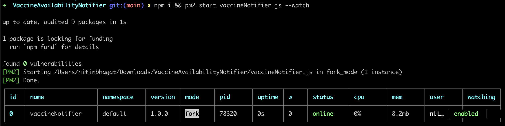
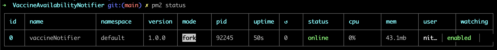
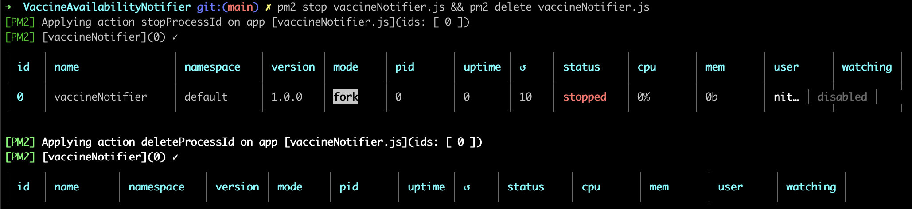
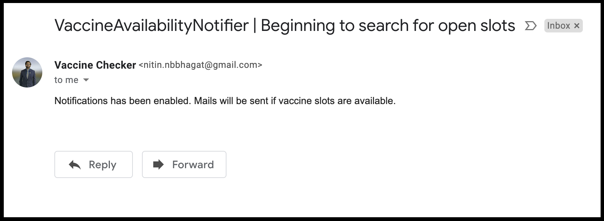
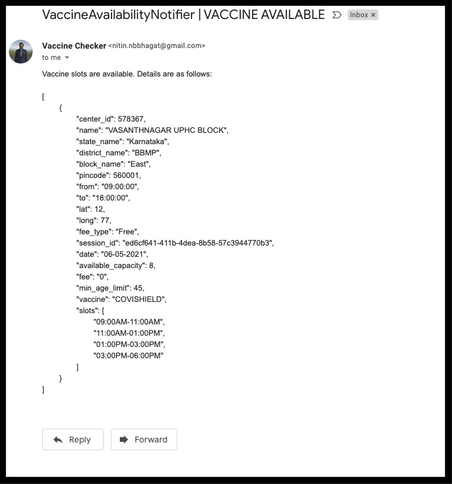

# VaccineAvailabilityNotifier
VaccineAvailabilityNotifier checks the Co-WIN Portal once every 30 minutes to find vaccination slots available in your PIN code and for your age. If found, it will send you a notification via Email.

---

## Prerequisites

1. Enable application access on your Gmail by following [Sign in with App Passwords](https://support.google.com/accounts/answer/185833?p=InvalidSecondFactor&visit_id=637554658548216477-2576856839&rd=1).

2. Install Git for your OS by following [Getting Started - Installing Git](https://git-scm.com/book/en/v2/Getting-Started-Installing-Git).

3. [Clone GitHub Repo](https://docs.github.com/en/github/creating-cloning-and-archiving-repositories/cloning-a-repository) by running below commands in a terminal:
    ```
    $ git clone https://github.com/nitinnbbhagat/VaccineAvailabilityNotifier.git
    $ cd VaccineAvailabilityNotifier
    ```

4. Update the `.env` file by adding PINCODE, EMAIL, APPLICATION_PASSWORD (16-character code from Step 1) and AGE. <br>
    `$ vi .env`

    > **Note:**<br>
    **UPDATE ONLY THE FIRST FOUR LINES.**

5. Install dependencies:
    * Install NPM for your OS from [Installing Node.js via package manager](https://nodejs.org/en/download/package-manager).
    * Install `pm2`: <br>
        `$ npm install pm2 -g`

---

## Steps to run the code
1. To start the app: <br>
    `$ npm i && pm2 start vaccineNotifier.js --watch`

    On successful execution, below output is generated: <br>
     <br>

    You will instantly get a mail with the subject line, **"VaccineAvailabilityNotifier | Beginning to search for open slots".**

2. To check if the app is running: <br>
    `$ pm2 status`

    On successful execution, below output is generated: <br>
    

2. To close the app: <br>
    `$ pm2 stop vaccineNotifier.js && pm2 delete vaccineNotifier.js`

    On successful execution, below output is generated: <br>
    

---

## Sample of resultant mails

1. First mail - enabling notifications: <br>


2. Subsequent mails - receiving notifications if vaccine slots are available: <br>
    Subject Line: **VaccineAvailabilityNotifier | VACCINE AVAILABLE**
    

---

## Important Links

* [Co-WIN Home Page](https://www.cowin.gov.in/home)
* [Manual Registration](https://selfregistration.cowin.gov.in/)
* [Co-WIN Public APIs](https://apisetu.gov.in/public/api/cowin)
* [Aarogya Setu](https://www.aarogyasetu.gov.in/)
* [UMANG](https://web.umang.gov.in/web_new/login?redirect_to=)